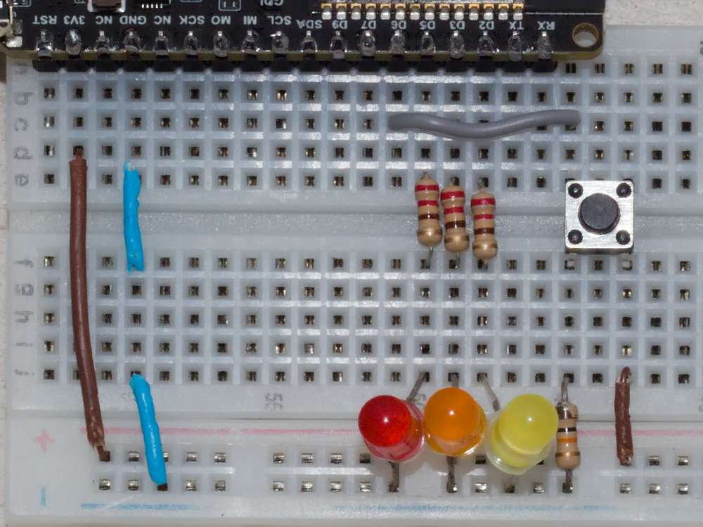

# S3-Pony-Keeb — Development Log



<div align="center"><em>Physical layout and wiring diagram</em></div>

## Original Requirements

1. **Bluetooth pairing** — pair the ESP32-S3 with a phone over BLE
2. **HID keyboard** — act as a Bluetooth keyboard and send the Space key on button press
3. **Sleep mode** — put the board to sleep; on button press, wake up and send Space over Bluetooth

## Development Extras

The following were added during development for debugging and ease of use:

- **Config button** for bond clearing / re-pairing
- **3 LEDs** (red, orange, yellow) as a status dashboard
- **Three-tier power management** instead of simple deep sleep
- **Serial debug logging** via USB CDC / PlatformIO

## Hardware

| Component     | Pin          | Details                                           |
| ------------- | ------------ | ------------------------------------------------- |
| Red LED       | D5 (GPIO 7)  | Boot/wake indicator, 220Ω resistor                |
| Orange LED    | D3 (GPIO 38) | BLE status, 220Ω resistor                         |
| Yellow LED    | D2 (GPIO 3)  | Keystroke confirmation, 220Ω resistor             |
| Action Button | D6 (GPIO 18) | Sends Space, wakes from deep sleep                |
| Config Button | D7 (GPIO 9)  | Bond clear (hold 3s), pairing mode (hold at boot) |

## Issues Discovered & Resolved

### 1. Upload Port — `/dev/ttyS3` Does Not Work

**Problem:** PlatformIO defaulted to `/dev/ttyS3`, which is a motherboard serial port, not the ESP32-S3.

**Solution:** The ESP32-S3's native USB CDC appears as `/dev/ttyACM0` or `/dev/ttyACM1`. Set `upload_port` and `monitor_port` in `platformio.ini`. The port number can change after deep sleep reboots.

### 2. Board Not Detected on USB

**Problem:** With `ARDUINO_USB_CDC_ON_BOOT=1`, USB CDC only exists while firmware is running. If firmware enters deep sleep immediately, the USB port disappears and uploading becomes impossible.

**Solution:** Enter ROM bootloader mode: **hold BOOT → plug USB → release BOOT**. The board appears as a USB JTAG/serial debug unit regardless of firmware state. Used `esptool erase_flash` to wipe stuck firmware.

### 3. BLE Device Name Truncated

**Problem:** `"S3-Pony-Keyboard"` (16 chars) was truncated to `"S3-Pony-Keyboar"` — BLE HID name limit is 15 characters.

**Solution:** Shortened to `"S3-Pony-Keeb"` (12 chars).

### 4. Buttons Not Responding — Wrong Polarity

**Problem:** Buttons were wired to GND (press pulls pin LOW) but code expected HIGH on press (`INPUT` with external pull-down).

**Solution:** Changed `pinMode` to `INPUT_PULLUP` and all button checks to trigger on `LOW`. Later rewired buttons with **10kΩ pull-down to GND, button connects to 3V3** so pressed = HIGH, simplifying the code and deep sleep wake logic.

### 5. Deep Sleep — False Wake-ups

**Problem:** With buttons wired to GND (external pull-down), the internal pull-up turns off during deep sleep. The external pull-down then pulls the pin LOW, immediately triggering `ext0_wakeup(pin, 0)`.

**Solution (software):** `rtc_gpio_pullup_en()` keeps the pull-up active during deep sleep.

**Solution (hardware — adopted):** Rewired buttons with external pull-up to 3V3. Now the external resistor keeps the pin HIGH during deep sleep. Wake triggers on HIGH (button press). No RTC GPIO workarounds needed.

### 6. Deep Sleep — BLE Reconnection Too Slow

**Problem:** Full deep sleep kills BLE entirely. Every wake requires a complete reboot → BLE init → advertising → phone reconnect (3-8 seconds). Most button presses timed out before connecting.

**Solution:** Moved from "everything in `setup()` with deep sleep" to a **`loop()`-based architecture** where BLE stays connected. Deep sleep is only used as a last resort after prolonged inactivity.

### 7. Manual Light Sleep — BLE Also Disconnects

**Problem:** `esp_light_sleep_start()` (manual) still tears down BLE. On wake, a full reconnect is needed — same problem as deep sleep but slightly faster.

**Solution:** Replaced manual light sleep with **automatic light sleep via `esp_pm_configure()`**. The CPU automatically naps between BLE connection intervals. BLE stays connected. Button press is almost instant — no reconnect.

### 8. `bleKeyboard.print(" ")` — Keystroke Not Always Received

**Problem:** `bleKeyboard.print(" ")` sometimes failed to register on the phone.

**Solution:** Changed to proper HID press/release cycle:

```cpp
bleKeyboard.press(' ');
delay(50);
bleKeyboard.releaseAll();
```

### 9. Serial Monitor Port Mismatch

**Problem:** Serial monitor showed no output. The ESP32-S3 USB JTAG/serial was on `/dev/ttyACM1` but PlatformIO was connecting to the wrong port. Port number also changes after deep sleep reboot.

**Solution:** Set `monitor_port = /dev/ttyACMx` in `platformio.ini`. Note: after deep sleep, the port may increment (`ACM0` → `ACM1`).

## Current Architecture

### Power Management — Three Tiers

| State                           | Trigger                                | Power    | BLE           | Wake                        |
| ------------------------------- | -------------------------------------- | -------- | ------------- | --------------------------- |
| **Full speed** (240MHz)         | Active use                             | ~100mA   | Connected     | —                           |
| **Auto light sleep** (80/10MHz) | 10s no key press                       | ~5-15mA  | **Connected** | Instant (no reconnect)      |
| **Deep sleep**                  | 30s no key press OR 2 min disconnected | ~10-20µA | Off           | Action button → full reboot |

### LED Dashboard

| LED             | Meaning                    |
| --------------- | -------------------------- |
| Red ON          | Board is powered/booted    |
| Orange blinking | Waiting for BLE connection |
| Orange solid    | BLE connected              |
| Yellow flash    | Keystroke sent             |

### Button Functions

| Button                   | Action                            |
| ------------------------ | --------------------------------- |
| Action (D6)              | Send Space / Wake from deep sleep |
| Config (D7) press        | (reserved)                        |
| Config (D7) hold 3s      | Clear all BLE bonds & restart     |
| Config (D7) hold at boot | Clear bonds (legacy)              |

## Key Learnings

1. **ESP32-S3 USB CDC disappears during deep sleep** — always have a way to enter bootloader (BOOT + reset)
2. **Internal pull-ups turn off in deep sleep** — use external pull-ups/pull-downs for wake pins
3. **Wiring buttons to VCC with external pull-down** is simpler for deep sleep than wiring to GND with pull-up
4. **BLE HID device names are limited to 15 characters**
5. **`esp_pm_configure()` auto light sleep** keeps BLE alive while saving power — much better than manual `esp_light_sleep_start()` for BLE devices
6. **`bleKeyboard.press()` + `releaseAll()`** is more reliable than `print()` for single keystrokes
7. **`ext0_wakeup`** is for deep sleep; **`gpio_wakeup_enable`** is faster for light sleep (but moot with auto light sleep)

## Files

- `src/main.cpp` — firmware source
- `platformio.ini` — build config, libraries, ports
- `docs/specifications.md` — original project spec
